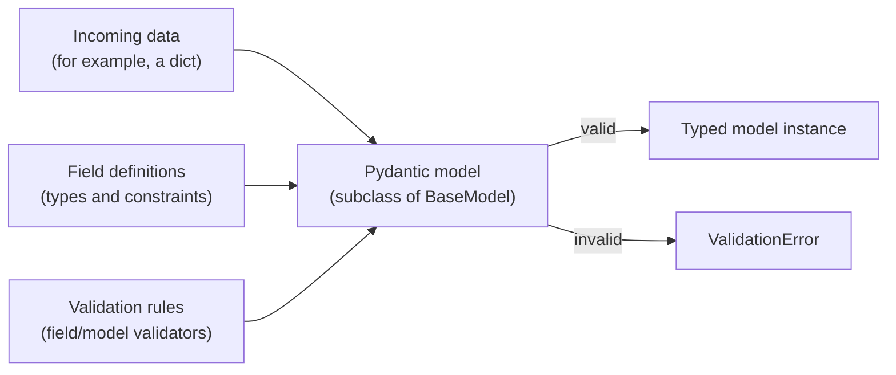

# Data Validation

A project about validating structured data with [Pydantic](https://docs.pydantic.dev/).

## Purpose

Data validation checks that incoming values have the expected structure and satisfy
the rules declared by an application. Pydantic models provide a class-based way to
describe that structure: fields define the data shape and constraints, and
validation produces either a typed model instance or validation errors.

## Repository status

The repository currently contains this README only. It has no application source,
project-specific classes, declared dependencies, or tests yet. As a result, there
is not an implemented API or concrete class hierarchy to document. The diagram
below describes the general Pydantic validation flow this project name suggests;
it is conceptual, not a map of existing repository code.

## Conceptual validation flow

### Concepts and relationships

- **Model class** — describes one validated data shape and, in a Pydantic
  application, typically subclasses `pydantic.BaseModel`.
- **Fields** — belong to a model and specify the expected values, types, and
  constraints for its attributes.
- **Validators** — add checks for values or relationships between fields. Their
  exact form depends on the Pydantic version and the rules being implemented.
- **Validation result** — accepted input becomes a model instance; rejected input
  yields validation errors that callers can inspect or report.

These are Pydantic concepts, not classes currently defined in this repository.

## Finding and understanding project classes

When implementation is added, document each public class alongside its source
file. For each class, explain its responsibility, important fields and validation
rules, what creates or consumes it, and how it relates to other project classes.
Keep the class relationship diagram grounded in the actual imports, inheritance,
and data flow; distinguish external Pydantic classes from project-defined ones.

For concrete behavior, the implementation and tests should be treated as the
authoritative references. This README can then link to those files and describe
the supported public API, setup, and examples.
