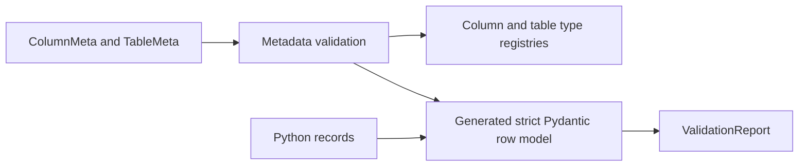
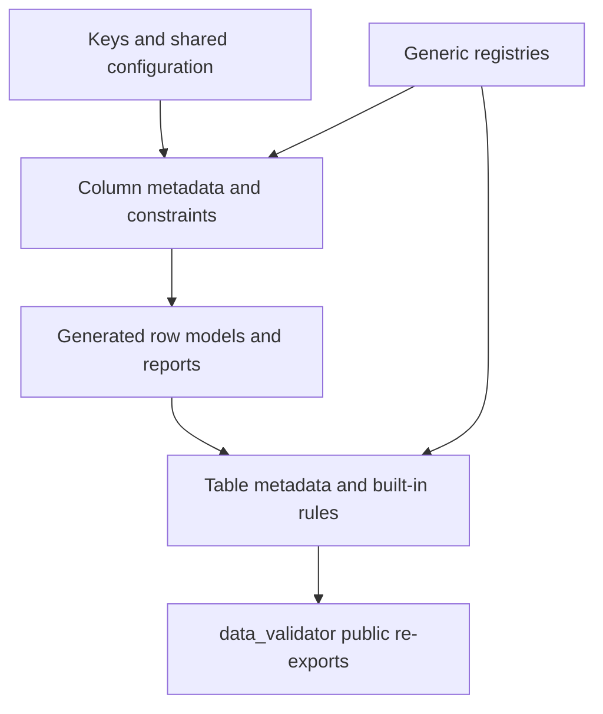
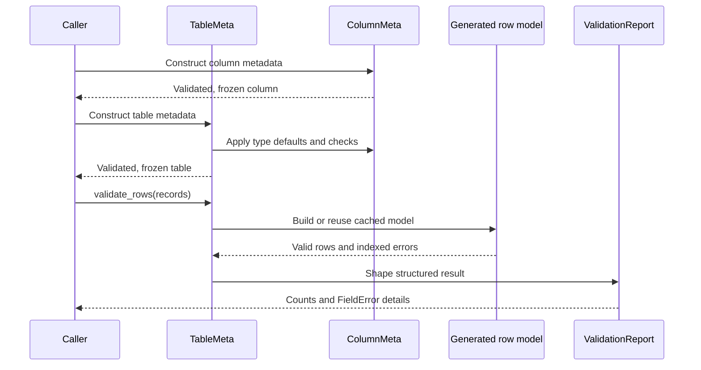

# data-validation

> Strict, declarative data-warehouse schema and runtime row validation for Python.

`data-validation` models SQL-oriented columns and tables with Pydantic v2, then
compiles those declarations into strict runtime row models. It is intended for
schema definitions that need both structural rules (for example, a fact table
must contain a foreign key and a numeric measure) and record-level validation
(for example, a decimal must fit a precision/scale or a string must match a
pattern).

## At a glance



The package has no application server, database client, persistence layer, or
CLI. It validates Python data structures and schema metadata; callers decide
how validated rows are stored or used.

## Installation

The project requires Python 3.11 or newer and Pydantic 2.7 or newer (below 3).
From a checkout, install the package with:

```text
pip install -e .
```

For development, install the optional test and quality tools as well:

```text
pip install -e ".[dev]"
```

The repository uses `.venv` in its documented commands because the system pip
is externally managed. The package version is currently exposed as
`data_validator.__version__`.

## Quick start

Create a table schema with a primary key and a constrained label, then validate
records through the generated row model:

```python
from data_validator import ColumnMeta, ColumnType, SqlType, TableMeta, TableType

customers = TableMeta(
    name="dim_customer",
    table_type=TableType.DIMENSION,
    columns=(
        ColumnMeta(
            name="customer_id",
            sql_type=SqlType.INT,
            column_type=ColumnType.PRIMARY_KEY,
        ),
        ColumnMeta(name="label", sql_type=SqlType.NVARCHAR, max_length=50),
    ),
)

row = customers.row_model.model_validate({"customer_id": 1, "label": "Acme"})
assert row.customer_id == 1
```

`TableMeta` checks the table name, duplicate column names, and the rules for its
table type when it is constructed. `row_model` is created lazily and cached on
the table instance.

## Core concepts

### SQL types

`SqlType` describes the physical type and maps it to a Python type:

| SQL key | Python type | Additional family |
| --- | --- | --- |
| `BIT` | `bool` | Boolean |
| `SMALLINT`, `INT`, `BIGINT` | `int` | Numeric |
| `DECIMAL`, `NUMERIC` | `Decimal` | Numeric; precision/scale supported |
| `FLOAT` | `float` | Numeric |
| `VARCHAR`, `NVARCHAR`, `CHAR`, `NCHAR` | `str` | String |
| `DATE` | `date` | Temporal |
| `DATETIME2` | `datetime` | Temporal |

The enum also exposes `python_type`, `is_numeric`, `is_string`, `is_temporal`,
`is_boolean`, and `supports_precision_scale`.

### Column metadata

`ColumnMeta` is a frozen Pydantic model describing one column. Its main fields
are:

| Field | Purpose |
| --- | --- |
| `name` | Identifier matching `[A-Za-z_][A-Za-z0-9_]*`, up to 128 characters |
| `sql_type` | One of the `SqlType` values |
| `column_type` | Registered behavior key; defaults to `miscellaneous` |
| `nullable`, `primary_key`, `indexed` | Nullability and key/index metadata |
| `references` | `table.column` reference for foreign keys |
| `default`, `allow_manual_default` | Field defaults and identity override behavior |
| `max_length`, `precision`, `scale` | String and decimal constraints |
| `min_value`, `max_value` | Numeric or temporal bounds |
| `regex_pattern`, `allowed_values` | Value-level constraints |
| `auto_utc`, `description`, `is_sensitive` | Generated dates and descriptive metadata |

The specialized `PrimaryKeyColumn`, `ForeignKeyColumn`, `IdentityColumn`,
`CompositeKeyColumn`, and `SystemDateColumn` classes set the corresponding
`column_type` automatically.

### Tables and declarations

`TableMeta` contains a name, a registered `table_type`, and zero or more
columns. Table names must use the prefix associated with their type. The
`pk` property returns primary-key columns.

Tables can be constructed directly, or declared as Python classes using
`ClassVar[ColumnMeta]` attributes. Declared columns are collected, including
columns inherited from a base table declaration:

```python
from typing import ClassVar

from data_validator import ColumnMeta, ColumnType, SqlType, TableMeta, TableType


class Customer(TableMeta):
    name: str = "dim_customer"
    table_type: TableType = TableType.DIMENSION
    customer_id: ClassVar[ColumnMeta] = ColumnMeta(
        name="customer_id", sql_type=SqlType.INT, column_type=ColumnType.PRIMARY_KEY
    )
    label: ClassVar[ColumnMeta] = ColumnMeta(name="label", sql_type=SqlType.NVARCHAR)


schema = Customer()
assert [column.name for column in schema.columns] == ["customer_id", "label"]
```

## Built-in table and column types

### Table types

Built-in table types are registered when `TableMeta` is imported. Their
prefixes and structural rules are:

| Type | Prefix | Rules or behavior |
| --- | --- | --- |
| `ACTIVE_LIST` | `al_` | Automatically scaffolds a primary key plus `is_active`; requires `BIT NOT NULL DEFAULT True` for the flag |
| `LOOKUP` | `lu_` | Exactly one primary key and at least one non-key column |
| `DIMENSION` | `dim_` | Exactly one primary key and at least one non-key column |
| `FACT` | `fact_` | At least one foreign-key column and one non-key numeric measure |
| `JUNCTION` | `jct_` | At least two primary-key columns, all of them foreign keys |
| `STAGING` | `stg_` | Prefix only; no additional structural rule |

An active-list table can therefore be created without explicitly supplying
columns:

```python
from data_validator import TableMeta, TableType

regions = TableMeta(name="al_region", table_type=TableType.ACTIVE_LIST)
row = regions.row_model.model_validate({"region": "north"})
assert row.is_active is True
```

### Column types

| Type | Defaults and checks |
| --- | --- |
| `PRIMARY_KEY` | `primary_key=True`, `nullable=False`, `indexed=True`; must remain a non-nullable indexed key |
| `FOREIGN_KEY` | Requires `references` |
| `IDENTITY` | Requires `INT` or `BIGINT`; manual defaults require `allow_manual_default=True` |
| `COMPOSITE_KEY` | Same key defaults and key invariant as `PRIMARY_KEY` |
| `SYSTEM_DATE` | `nullable=False`, `auto_utc=True`; requires `DATE` or `DATETIME2` |
| `MISCELLANEOUS` | No additional built-in rule |

Built-in enum values are normalized back to their `ColumnType` or `TableType`
members after validation, even when supplied as strings.

## Row validation

The table metadata is compiled into a frozen, strict Pydantic model. Fields are
required unless they are nullable or have a default/default factory, and extra
fields are rejected. Strictness means values are not generally coerced: an
`INT` field rejects the string `"1"`. `DECIMAL` and `NUMERIC` deliberately
accept decimal strings and parse them as `Decimal` values.

Column metadata compiles the following checks into the row model when relevant:

- string maximum length and regular-expression constraints;
- allowed-value membership;
- decimal precision, scale, finite-value, and decimal-string parsing;
- numeric and temporal inclusive minimum/maximum bounds;
- `DATE` defaults using `date.today()`;
- `DATETIME2` system-date defaults using the current UTC datetime;
- explicit defaults and nullable `None` values.

For batch processing, `validate_rows()` preserves the original record indexes
in a structured immutable `ValidationReport`:

```python
from data_validator import ColumnMeta, SqlType, TableMeta, TableType

table = TableMeta(
    name="stg_amounts",
    table_type=TableType.STAGING,
    columns=(ColumnMeta(name="amount", sql_type=SqlType.DECIMAL, nullable=False),),
)
report = table.validate_rows([{"amount": "12.50"}, {"amount": "not-a-number"}, {"extra": 1}])

assert report.valid_count == 1
assert report.invalid_count == 2
assert [error.row_index for error in report.invalid_rows] == [1, 2]
assert report.invalid_rows[0].errors[0].field == ("amount",)
```

Each `RowValidationError` contains a `row_index` and `FieldError` values with
the failing `field`, Pydantic `message`, and `error_type`. The
`validate_rows_legacy()` method remains available for callers that need the
older `(valid_rows, [(index, ValidationError)])` result shape.

## Custom extensions

Column and table behavior is registry-driven. Register a `ColumnTypeSpec` with
optional defaults and a check returning a message (or `None`), and register a
`TableTypeSpec` with a prefix, structural rules, and optional scaffold:

```python
from data_validator import (
    ColumnMeta,
    ColumnTypeSpec,
    SqlType,
    TableMeta,
    TableTypeSpec,
    register_column_type,
    register_table_type,
)


def audit_user_check(column: ColumnMeta) -> str | None:
    return None if column.sql_type.is_string else "requires a string type"


def snapshot_rules(table: TableMeta) -> list[str]:
    return (
        [] if any(column.name == "as_of" for column in table.columns) else ["needs an as_of column"]
    )


register_column_type(ColumnTypeSpec("audit_user", {"nullable": False}, audit_user_check))
register_table_type(TableTypeSpec("snapshot", "snap_", snapshot_rules))

table = TableMeta(
    name="snap_balances",
    table_type="snapshot",
    columns=(
        ColumnMeta(name="as_of", sql_type=SqlType.DATE, nullable=False),
        ColumnMeta(name="loaded_by", sql_type=SqlType.NVARCHAR, column_type="audit_user"),
    ),
)
assert table.table_type == "snapshot"
```

Keys must be valid identifiers. Registering an existing key raises `ValueError`
unless `replace=True` is supplied. Use `get_column_type_spec()` or
`get_table_type_spec()` to inspect a registration and the corresponding
`unregister_*` function to remove one. Unknown keys raise `UnknownTypeError`
(wrapped as Pydantic validation errors when used in a model).

Registries are process-global. Applications should register extensions during
startup and should avoid changing a spec while models are being used.

## API overview

The package re-exports the primary public API from `data_validator`:

| Area | Public names |
| --- | --- |
| Metadata | `ColumnMeta`, `TableMeta`, `PrimaryKeyColumn`, `ForeignKeyColumn`, `IdentityColumn`, `CompositeKeyColumn`, `SystemDateColumn` |
| Keys | `SqlType`, `ColumnType`, `TableType`, `Ident`, `Reference`, `ACTIVE_FLAG` |
| Specs and registries | `ColumnTypeSpec`, `TableTypeSpec`, `register_column_type()`, `register_table_type()`, `get_column_type_spec()`, `get_table_type_spec()`, `unregister_column_type()`, `unregister_table_type()` |
| Results and errors | `ValidationReport`, `RowValidationError`, `FieldError`, `UnknownTypeError` |
| Declaration support | `TableDeclarationMeta` |

Lower-level modules are organized under `data_validator.columns`,
`data_validator.rows`, `data_validator.tables`, and `data_validator.types`.

## Architecture

The package uses a one-way dependency structure:



| Layer | Location | Responsibility |
| --- | --- | --- |
| 0 | `src/data_validator/_base.py`, `registry.py`, `types/` | Shared Pydantic configuration, identifiers, registries, and enum keys |
| 1 | `src/data_validator/columns/` | Column metadata, built-in column specs, and compiled field validators |
| 2 | `src/data_validator/rows/` | Dynamic row model creation, batch validation, and immutable reports |
| 3 | `src/data_validator/tables/` | Table declarations, built-in table rules, scaffolding, and row-model delegation |
| Public API | `src/data_validator/__init__.py` | Stable re-exports and package version |

The primary runtime path is:



## Development and testing

The repository's development dependencies are `pytest`, `ruff`, and `mypy`.
With the project virtual environment configured, the supported checks are:

```text
.venv/bin/pytest
.venv/bin/pytest tests/unit
.venv/bin/pytest tests/integration
.venv/bin/ruff check .
.venv/bin/ruff format --check .
.venv/bin/mypy
```

Tests are split into `tests/unit` for focused behavior and `tests/integration`
for end-to-end schemas and row validation. The test configuration also applies
the `unit` and `integration` markers automatically based on directory.

## Compatibility and limitations

- Supported Python versions begin at 3.11 (`requires-python = ">=3.11"`).
- Supported Pydantic versions are `>=2.7,<3`; the implementation uses Pydantic
  v2 validators, `create_model`, and a private Pydantic `ModelMetaclass` API for
  class-based table declarations.
- The package validates in-memory Python mappings. It does not create database
  tables, execute SQL, serialize to a warehouse, or provide a transport/API
  server.
- Metadata and generated rows are frozen. Mutation should be expressed by
  constructing new models or records.
- Type registries are global and mutable; registration order and replacement
  are application concerns.
- The `is_sensitive` flag is metadata only; no masking or redaction behavior is
  implemented.
- The package does not define a persistence or deployment model. Those concerns
  remain with the consuming application.

## Repository map

```text
src/data_validator/
├── _base.py                 # shared configs, identifier types, ACTIVE_FLAG
├── registry.py              # generic keyed registry
├── types/                   # SQL, column-type, and table-type keys
├── columns/                 # column metadata and compiled constraints
├── rows/                    # generated row models and validation reports
├── tables/                  # table declarations, rules, and scaffolding
└── __init__.py              # public re-exports

tests/
├── unit/                    # focused model, registry, rule, and layering tests
└── integration/             # custom types, README examples, and row flows
```

For the fastest orientation, start with `src/data_validator/__init__.py`, then
read `columns/model.py`, `tables/model.py`, and `rows/engine.py`; the
integration tests show complete schemas and extension scenarios.